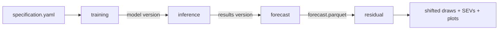

# Running the pipeline

This page is the operational reference: the steps, the commands, what each step
consumes and produces, and how to pick things up again when something fails
partway.

For what the steps *do* statistically, see
[Training Methodology](model.md), [Inference and Forecasting](inference.md) and
[Residual Modeling](residual.md). For the versions currently in use, see
[Current Versions](versions.md).

## The two entry points

Everything is driven through two console scripts, installed by the package:

| Command | What it does |
| --- | --- |
| `strun <step>` | **Launcher.** Allocates a new version if the step makes one, then submits a `jobmon` workflow to SLURM that fans the work out into many `sttask` jobs. |
| `sttask <step>` | **Worker.** Runs one unit of work in the current process. This is what the cluster jobs actually execute, and it is also how you run a single piece by hand for debugging. |

Both need the `cluster` or `cluster-dev` environment, because `strun` imports
`jobmon`:

```sh
pixi shell -e cluster-dev
strun --help
sttask --help
```

The steps registered on each:

| Step | `strun` | `sttask` | Makes a new version |
| --- | :---: | :---: | --- |
| `data_prep` | yes | yes | training data version |
| `ldi_prep` | yes | yes | — |
| `training` | yes | yes | **model version** |
| `inference` | yes | yes | **results version** |
| `forecast` | — | yes | — (works on an existing results version) |
| `residual` | yes | yes | — (works on an existing results version) |

!!! note
    Data prep (`data_prep`, `ldi_prep`) is deliberately left out of this page —
    see [Input Data](inputs.md). The four steps below are the modeling
    pipeline proper.

## The four steps



Each step reads the previous step's output out of the shared output root and
writes its own alongside it. The default output root is

```
/mnt/team/rapidresponse/pub/population/modeling/climate_malnutrition
```

and every command takes `-o/--output-root` to point somewhere else.

Under it, each measure gets its own tree:

```
{output_root}/{measure}/
├── training_data/{training_data_version}/data.parquet
├── models/{model_version}/          <- written by training
└── results/{results_version}/       <- written by inference, forecast, residual
```

### 1. Training

Fits the model described by a specification file and saves the coefficients.

```sh
# Launch on the cluster
strun training specifications/stunting.yaml -q long.q

# Run one submodel in this process
sttask training -m stunting -t 2026_07_06.04 -s age_group_id 388 -s sex_id 1
```

`strun training` is the one step that takes a **file path** rather than a
measure and a version. Everything else comes out of the specification:

* `measure:` selects which measure tree gets written to.
* `version.training_data:` pins the training data version to fit on.
* `submodel_vars:` says which variables to fit separate models by. `strun`
  takes the cross product of those variables' values *in the training data* and
  submits one `sttask training` job per combination.
* `model_type:` is `lmer` (a `pymer4` mixed-effects logistic regression) or
  `scam` (an R `scam` shape-constrained additive model). See
  [Training Methodology](model.md).

The launcher allocates the next model version for the measure, creates
`models/{model_version}/`, and writes the specification into it as
`specification.yaml` with `version.model` filled in. **The version is chosen by
the launcher, not by you** — it is printed on stdout, and it is also the
directory that the jobmon logs land in.

What lands in `models/{model_version}/`:

| File | Contents |
| --- | --- |
| `specification.yaml` | The spec as run, with the model version stamped in |
| `base_model.pkl`, or one `{var}__{value}___{var}__{value}.pkl` per submodel | The pickled fitted model |
| `*_coefs.parquet` | Fixed effects |
| `*_ranef.parquet` | Random effects |
| `*_{predictor}_spline_effects.parquet` | Fitted spline curve per spline predictor (`scam` only) |
| `raw_with_predictions.parquet` | Training rows with fitted values (`scam` only) |
| rasterized intercept | The intercept (fixed + location random effect) burned onto the raster template, so inference does not have to redo it |
| diagnostic plots | Written by `training_diagnostics` |

Practical notes:

* Tasks ask for **500 Gb and a 150 h runtime, with `max_attempts=1`**. That
  runtime is longer than `all.q` allows, so pass `-q long.q`. A failed
  submodel is not retried — check the logs under the version directory.
* Submodels are independent jobs, so a run can be partially successful. Rerun
  a single missing submodel with `sttask training -m ... -t ... -s var value`;
  it writes into the existing model version rather than making a new one.

### 2. Inference

Applies the fitted coefficients to gridded climate and income futures, one job
per (scenario, year, sex, age group, draw), and aggregates each grid to
FHS locations.

```sh
strun inference -m stunting -t 2026_07_06.04 \
    -c all -y all -s all -a all -d 100 -q all.q
```

| Option | Meaning |
| --- | --- |
| `-t/--model-version` | The model version to predict from (required) |
| `-m/--measure` | Measure |
| `-c/--cmip6-scenario` | `ssp126`, `ssp245`, `ssp585`, or `all` |
| `-y/--year` | Any year 2000–2100, or `all` |
| `-s/--sex-id` | `1` (male), `2` (female), or `all` |
| `-a/--age-group-id` | An age group valid for the measure, or `all` |
| `-d/--draws` | Number of draws to run |

`all` for age groups expands to the measure's own age groups, which are listed
per measure in `cli_options.AGE_GROUP_IDS_BY_MEASURE`. Passing an age group
that the measure does not model is a hard error rather than a silent no-op.

The launcher allocates the next **results version**, writes
`results/{results_version}/results_spec.yaml` recording the model version,
draws, age groups, sexes, scenarios and years, and then submits the fan-out.
Again: the version is chosen for you and printed on stdout.

Two things about how the task list is built:

* **Past years get one draw and one scenario.** Years before
  `FIRST_FORECAST_YEAR` (2024) are historical, so they only run for the
  reference scenario (`ssp245`) at draw 0. Forecast years run the full
  scenario × draw grid. The forecast step later reuses those single past-year
  files for every scenario.
* **Income scenario follows the climate scenario.** `ssp126` → `better`,
  `ssp245` → `reference`, `ssp585` → `worse`.

Per-task outputs in `results/{results_version}/`:

| File | Contents |
| --- | --- |
| `{year}_{scenario}_{age_group_id}_{sex_id}_{draw}.parquet` | Population-weighted prevalence per most-detailed FHS location |
| `{year}_{scenario}_{age_group_id}_{sex_id}_{draw}.tif` | The prevalence raster — **only saved for 2023 and 2100**, since a raster per year/draw would be enormous |

Tasks ask for 55 Gb and 80 minutes, with `max_attempts=2` and a concurrency
limit of 1000.

**`strun inference` submits the forecast step for you** as a second jobmon
workflow once the fan-out finishes. You only run `forecast` by hand in the
rerun case below.

### 3. Forecast

Collects the per-task parquets into scenario draw files and one summary table.
There is no `strun forecast`; it is a single job.

```sh
sttask forecast -m stunting -r 2026_07_13.01
```

It reads `results_spec.yaml` to know which files to expect, so it fails with a
missing-file error if any inference task did not finish — which is exactly what
makes it a useful completeness check.

| File | Contents |
| --- | --- |
| `{scenario}.parquet` | Draws wide (`draw_0` … `draw_n`) indexed by location/year/sex/age, one file per scenario |
| `forecast.parquet` | Draw-mean prevalence, population, affected counts, the delta against the reference scenario, and location/region/super-region names |
| `forecast_diag.pdf` | Inference diagnostics report |

Population comes from the FHS population files hard-coded at the top of
`inference/run_inference.py` — past and future, draw level, scenario 130 for
the future.

For `child_mortality` the age-specific mortality rates are aggregated across
ages into `age_group_id` 1 by taking the product of survival probabilities,
rather than being summed.

### 4. Residual

Reconciles the forecast with GBD, then produces the final prevalence draws,
the SEV draws for the child growth failure measures, and the diagnostic plots.

```sh
strun residual -m stunting -r 2026_07_13.01
sttask residual -m stunting -r 2026_07_13.01   # same thing, in this process
```

`strun residual` checks that `forecast.parquet` exists and fails immediately
with a clear message if it does not. The task asks for 150 Gb and 240 minutes
with `max_attempts=1`.

This step also needs cached GBD inputs under `{output_root}/input/gbd_prevalence/`,
which are **not** produced by the pipeline and must be refreshed from an IHME
environment. That, the residual model itself, and the full output list are
documented in [Residual Modeling](residual.md).

## Versions and how they chain

Versions are `{YYYY_MM_DD}.{NN}` directories, allocated in order on the day
they are created — `2026_07_13.01` is the first version made on 13 July 2026.
Model versions and results versions are numbered independently, so the same
string can mean different things under `models/` and `results/`.

The chain is recorded in the outputs, not in the command you typed:

```
results/{results_version}/results_spec.yaml   -> version.model
models/{model_version}/specification.yaml     -> version.training_data
training_data/{training_data_version}/
```

So a results version is enough to recover the model, the specification, and the
training data behind any set of numbers. That is worth doing before trusting a
results version you did not launch yourself:

```sh
cat {output_root}/stunting/results/2026_07_13.01/results_spec.yaml
cat {output_root}/stunting/models/2026_07_06.04/specification.yaml
```

Note that `forecast`, `residual` and the diagnostics all write **into** the
results version directory rather than making a new one, so rerunning them
overwrites in place.

## Rerunning and picking up after a failure

Because every step writes into a version directory rather than creating one, a
partial run is resumable — you re-submit only the missing work.

**Jobmon logs** for each step live under the version directory the launcher
created (`log_root` is set to the model or results version path), which is the
first place to look.

Common situations:

* **A few training submodels failed.** Rerun each with
  `sttask training -m MEASURE -t MODEL_VERSION -s var value ...`. `max_attempts`
  is 1, so nothing was retried for you.
* **Some inference tasks failed.** Rerun the specific combinations with
  `sttask inference -m ... -r RESULTS_VERSION -t MODEL_VERSION -c ... -y ... -s ... -a ... -d ...`,
  then run `sttask forecast -m ... -r RESULTS_VERSION` yourself — the automatic
  forecast submission already ran and failed on the missing files.
* **Forecast complains about a missing file.** That is a missing inference
  task, not a forecast bug. The filename in the error names the exact
  scenario/year/age/sex/draw to rerun.
* **You want to redo the residual step only** (new GBD inputs, a changed
  residual setting): rerun `strun residual` on the same results version. It
  reads the scenario draw files, so nothing upstream is recomputed.
* **You want to re-forecast with different aggregation but the same
  inference.** Run `sttask forecast` again on the same results version; it
  regenerates `{scenario}.parquet` and `forecast.parquet` in place.

Since results versions are cheap directories, prefer launching a fresh
`strun inference` over hand-patching a results version whose provenance you
are no longer sure of.

## Running a whole measure end to end

```sh
pixi shell -e cluster-dev

# 1. Fit. Prints the new model version, e.g. 2026_07_06.04
strun training specifications/stunting.yaml -q long.q

# 2. Predict + forecast. Prints the new results version, e.g. 2026_07_13.01
#    This also submits the forecast step.
strun inference -m stunting -t 2026_07_06.04 -c all -y all -s all -a all -d 100

# 3. Reconcile against GBD and make the final draws and plots
strun residual -m stunting -r 2026_07_13.01
```

Then record the pair in [Current Versions](versions.md).
